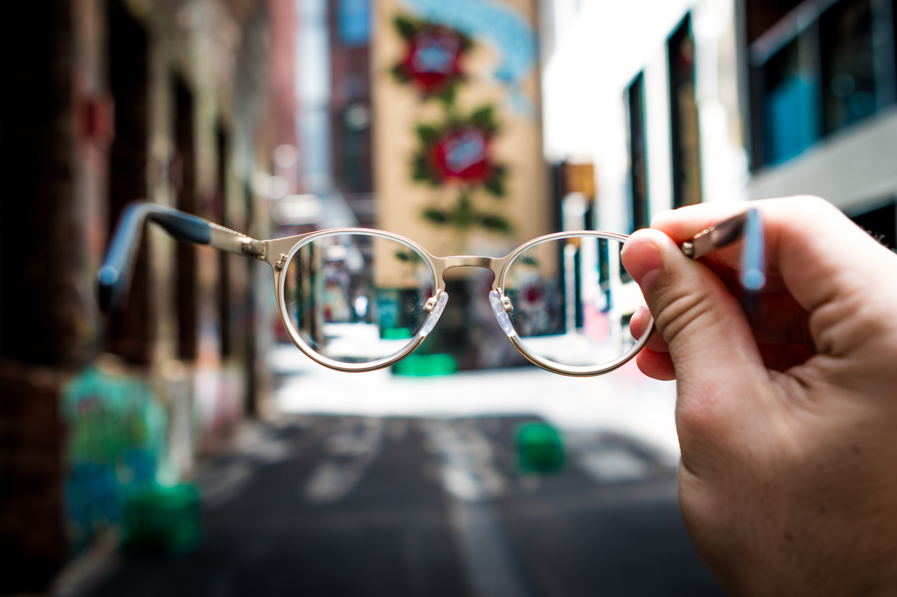

# Myopia in Children



## Table of Contents

- [Background](#background)
- [Dataset](#dataset)
- [Purpose and Predictions](#purpose)
- [Installation](#installation)
- [Extract, Transform, Load](#extract-transform-load)
- [Machine Learning](#machine-learning)
- [Findings](#findings)
- [Features](#features)
- [Future Considerations](#future-considerations)
- [Credits](#credits)
- [Badges](#badges)


## Background

### What is Myopia? 
Myopia is nearsightedness, or the condition when the eye can see objects clearly up close but objects further away appear blurry. Myopia is a common condition that affects an estimated 25% of Americans. It is an eye focusing disorder, not an eye disease.

Myopia occurs when the light entering the eye does not align properly with the retina and the light rays focus in front of the retina instead of on it. This can be due to a couple of different factors including the length of the eye or the shape of the cornea. 

Myopia is often discovered in children when they are between ages 8 and 12 years old. Many children in this age bracket have an onset of eyestrain, headaches, squinting, and inability to see distant objects such as the smartboard at school. Myopia can peak during the teenage years when the body grows rapidly, but usually has little to no change during middle adulthood.

Mild myopia is called low myopia. Severe myopia is called high myopia. High myopia will usually stabilize between the ages of 20-30 years old. People with myopia have a higher risk of detached retina and those that suffer from high myopia have a higher risk of developing eye diseases such as glaucoma and cataracts. 

https://www.aao.org/eye-health/diseases/myopia-nearsightedness

## Dataset

The dataset we use in our exploratory data analysis is a subset from the Orinda Longitudinal Study of Myopia (OLSM). This dataset is specifically focusing on the development of myopia in children. Observations and ocular details of each participant is from his or her right eye. 

Study and data collection began in the school year of 1989-1990 and concluded in 2000-2001. There are 618 participants (rows) and 17 variables (columns) excluding the ID (primary key) or index. For each year listed in the data, it is the year observations for the participant began. The MYOPIC column indicates a 0 for a participant that did not develop myopia and a 1 for participants who developed myopia within a 5-year re-check of their original exam. The age range for participants is from 5 years old to 9 years old. Each participant’s gender is specified by a 0 for male and a 1 for female. 

Columns of data about eye shape, size and anatomy include:

- SPHEQ - Spherical Equivalent Refraction which is a measure of the eye's effective focusing power. 

- AL – Axial Length measured in millimeters (mm) it is the length of the eye from front to back

- ACD - Anterior Chamber Depth measured in millimeters (mm) the length from front to back of the aqueous-containing space of the eye between the cornea and the iris

- LT - Lens Thickness measured in millimeters (mm) the length from front to back of the crystalline lens.

- VCD - Vitreous Chamber Depth measured in millimeters (mm) it’s the length from front to back of the aqueous-containing space of the eye in front of the retina. 

The number of hours per week a child spent doing physical activity including sports or outdoor activities outside of school is listed under SPORTHR. READHR is the number of hours per week a child spent reading for enjoyment outside of school. COMPHR is the number of hours per week a child spent playing computer and/or video games or working on a computer outside of school. STUDYHR is the number of hours a child spent studying or reading for school assignments outside of school. TVHR is the number of hours a child spent watching television per week. 
DIOPTERHR is the composite of near-sight/near-work activities in hours per week calculated as DIOPTERHR = 3× (READHR + STUDYHR) + 2 × COMPHR + TVHR

MOMMY indicates a 0 if the child’s mother did not have myopia and 1 if the child’s mother had myopia.
DADMY indicates a 0 if the child’s father did not have myopia and a 1 if the child’s father had myopia.

Information on family history and visual activities were collected yearly in a survey completed by a parent or guardian.

Source: Hosmer, D.W., Lemeshow, S. and Sturdivant, R.X. (2013) Applied Logistic Regression: Third Edition


[back to top](#table-of-contents)

## Purpose

The purpose of the exploration of this medical dataset is to get as close to FDA accuracy standards as possible with our machine learning models. Our experiments will use supervised and unsupervised machine learning to build and test models with the goal of getting an accuracy from 90-95%

## Predictions

We have two predictions for supervised machine learning models. We hypothesize that Random Forest Classification and Logistic Regression models will perform with high accuracies. A Random Forest model should be able to correctly bin the data due to uncorrelated features categorizing the input. Also, for unsupervised machine learning, we hypothesize that a Neural Network model will perform with the highest accuracy and provide the best model since we will be able to fit and hypertune it.


## Installation

A few programs, accounts, setups, dependencies and libraries need to be created and in place before running code

Programs:
- VS Code (or similar code editing software)

Accounts needed:
- Amazon AWS account
- Google 

Setups:
- AWS:
    - S3
- Google:
    - Google Colaboratory (open through Google Drive)

Tools & languages: PySpark, Google Colab, SQL, JavaScript, Plotly, HTML, matplotlib, Seaborn, Sci-Kit Learn

[back to top](#table-of-contents)

## Extract-Transform-Load

1. Clone this repository to your machine 

Create your S3 bucket

2. Open AWS (https://aws.amazon.com/) and sign in to your account (make sure you have root user selected)
3. Find and click S3 in the the Services or search for S3 in the search bar and select it
4. Click 'Create bucket'

General Configuration

5. Name your bucket (anything you like but we chose 'myopia' for this project) under 'Bucket name' it has to be a name that is not in use
6. Leave 'AWS Region' as is do not reset (only reset if it does not match what you chose when you created your account)

Object Ownership

7. ACLs disabled

Block Public Access settings for this bucket

8. Uncheck 'Block *all* public access'
9. It will pop up with a small warning symbol underneath, read the contents 
10. Check the box for 'I acknowledge that the current settings might result in this bucket and the objects within becoming public.' to continue 

Bucket Versioning

11. Disable

Tags

12. Tags are optional

Default encryption

13. Disable

Advanced settings

14. Object lock - Disable

15. Click Create Bucket

Upload CSV to bucket

1. Click the name of your bucket and then click Upload

2. Click Add files

3. Add the CSV from its location on your machine

4. Click Upload and it will display an upload status and then you can click Close

5. Now the bucket is up and running in the AWS cloud and ready to be accessed

Google Colaboratory

1. Through your Google Drive open a new page in Google Colaboratory (Google Colab for short) 

2. Click the '+ New' --> Scroll to 'More' --> Click Google Colaboratory or if you do not have it added go to 'Connect More Apps' and you can type it in the search bar and add it to your list from there

3. After opening a new page in Google Colab go to 'File' --> 'Upload notebook' --> 'Choose File'

4. Find where you saved the repository and click to add the Myopia.ipynb then click 'Open'

5. All libraries and dependencies are loaded, run the cells until you get to cell 4 where you see we are reading in the CSV file from our S3 bucket

Our code looks like the following 
```
url = "https://myopia.s3.amazonaws.com/Copy_of_myopia.csv"
```
It is possible you will need to change where we have 'myopia' to the specific name of your S3 bucket, also you may need to change where it says 'Copy_of_myopia.csv' to the name of the CSV you loaded into your bucket

After altering the names (if you need to) run the code and the first 10 rows of the CSV will appear in dataframe form.

6. Running the next line will inpect the data to look to drop duplicates and incomplete rows

7. Running the next cell ``` df.printSchema() ``` will examine the schema

8. After looking at the data we conclude that we don't need to drop any additional rows or columns from here

9. We can now save it as a JSON file by running the next line
```
df.write.json("users_json.json")
```
10. There is additional code below this line you can run if you wish to save this data into a database through AWS. Ultimately we did not need this step but it is available and works with the postgres option and will run on PgAdmin

11. You can change the name of the JSON file after saving it, also it may need to be cleaned and/or corrected in VS Code, you can use the 'Find and Replace' tool to find all of the ``` } ``` and replace with ``` }, ``` also you will need an opening bracket ```  [   ``` and a closing bracket ```  ]  ``` at the beginning and end of the JSON 

12. Now you are ready to start machine learning!

[back to top](#table-of-contents)

## Machine Learning

## Findings

## Features

Plotly Graphs


Tableau


Website


## Future Considerations

In the future, we would implement

## Credits
Team members:

Mariama Diallo https://github.com/diallomt193

Matthew Ward https://github.com/mward95

Harshad Patil https://github.com/harsh-env

Stefanie Gagnon https://github.com/skgag1216

## Resources

Data:

Hosmer, D.W., Lemeshow, S. and Sturdivant, R.X. (2013) Applied Logistic Regression: Third Edition

Publisher: Wiley, Hoboken, New Jersey, 2013
These data are copyrighted by John Wiley & Sons Inc. and must be acknowledged and 
used accordingly. 

https://github.com/evagian/Myopia-study-classification-logistic-regression-R

Images: (including images in slides)

https://unsplash.com/photos/qmnpqDwla_E?utm_source=unsplash&utm_medium=referral&utm_content=creditShareLink

https://www.freepik.com/free-vector/realistic-eye-anatomy-infographics_6405883.htm#page=3&query=human%20eye%20anatomy&position=0&from_view=search

https://unsplash.com/photos/aVvZJC0ynBQ?utm_source=unsplash&utm_medium=referral&utm_content=creditShareLink 

https://unsplash.com/photos/RdaKT5RtUk8

https://www.healthychildren.org/English/tips-tools/ask-the-pediatrician/Pages/avoid-eye-and-back-strain-from-the-computer.aspx

https://www.healthychildren.org/English/family-life/Media/Pages/Unhealthy-Video-Gaming.aspx

## Badges
[](https://github.com/mward95/Team_project_2/blob/main/MIT%20License/MIT%20License.txt)

[back to top](#myopia-in-children)