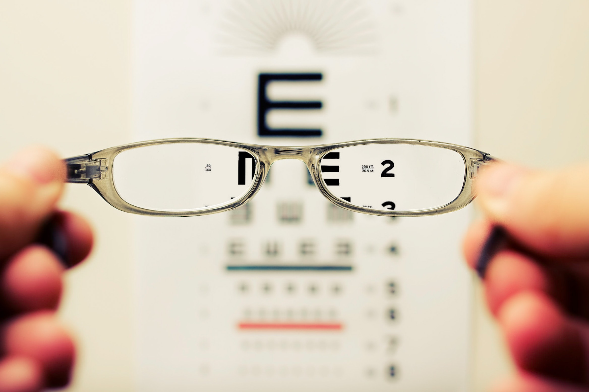

# Myopia in Children

## Table of Contents

- [Background](#background)
- [Installation](#installation)
- [Getting Started](#getting)
- [Extract, Transform, Load](#extract,transform,load)
- [Features](#features)
- [Credits](#credits)
- [Badges](#badges)

## Background

### What is Myopia? 
Myopia is nearsightedness, or the condition when the eye can see objects clearly up close but objects further away appear blurry. Myopia is a common condition that affects an estimated 25% of Americans. It is an eye focusing disorder, not an eye disease.

Myopia occurs when the light entering the eye does not align properly with the retina and the light rays focus in front of the retina instead of on it. This can be due to a couple of different factors including the length of the eye or the shape of the cornea. 

Mild myopia is called low myopia. Severe myopia is called high myopia. High myopia will usually stabilize between the ages of 20-30 years old. People with myopia have a higher risk of detached retina and those that suffer from high myopia have a higher risk of developing eye diseases such as glaucoma and cataracts. 

https://www.aao.org/eye-health/diseases/myopia-nearsightedness

### Dataset

The dataset we use in our exploratory data analysis is a subset from the Orinda Longitudinal Study of Myopia (OLSM). This dataset is specifically focusing on the development of myopia in children. Study and data collection began in the school year of 1989-1990 and concluded in 2000-2001. There are 618 participants (rows) and 17 variables (columns) excluding the ID (primary key) or index. For each year listed in the data, it is the year observations for the participant began. The MYOPIC column indicates a 0 for a participant that did not develop myopia and a 1 for participants who developed myopia within a 5-year re-check of their original exam. The age range for participants is from 5 years old to 9 years old. Each participant’s gender is specified by a 0 for male and a 1 for female. 

Columns of data about eye shape, size and anatomy include:

- SPHEQ - Spherical Equivalent Refraction which is a measure of the eye's effective focusing power. 

- AL – Axial Length measured in millimeters (mm) it is the length of the eye from front to back

- ACD - Anterior Chamber Depth measured in millimeters (mm) the length from front to back of the aqueous-containing space of the eye between the cornea and the iris

- LT - Lens Thickness measured in millimeters (mm) the length from front to back of the crystalline lens.

- VCD - Vitreous Chamber Depth measured in millimeters (mm) it’s the length from front to back of the aqueous-containing space of the eye in front of the retina. 

The number of hours per week a child spent doing physical activity including sports or outdoor activities outside of school is listed under SPORTHR. READHR is the number of hours per week a child spent reading for enjoyment outside of school. COMPHR is the number of hours per week a child spent playing computer and/or video games or working on a computer outside of school. STUDYHR is the number of hours a child spent studying or reading for school assignments outside of school. TVHR is the number of hours a child spent watching television per week. 
DIOPTERHR is the composite of near-sight/near-work activities in hours per week calculated as DIOPTERHR = 3× (READHR + STUDYHR) + 2 × COMPHR + TVHR

MOMMY indicates a 0 if the child’s mother did not have myopia and 1 if the child’s mother had myopia.
DADMY indicates a 0 if the child’s father did not have myopia and a 1 if the child’s father had myopia.

SOURCE: Hosmer, D.W., Lemeshow, S. and Sturdivant, R.X. (2013) Applied Logistic Regression: Third Edition

## Purpose

## Predictions

We have two predictions for supervised machine learning models. We hypothesize that Random Forest Classification and Logistic Regression models will perform with high accuracies. A Random Forest model should be able to correctly bin the data due to uncorrelated features categorizing the input. Also, for unsupervised machine learning, we hypothesize that a Neural Network model will perform with the highest accuracy and provide the best model since we will be able to fit and hypertune it.

We are predicting that a Linear Regression model would perform the worst due to allowing outliers to effect its predictive outcomes.

Our goal is to get as close to FDA standards as possible because we are working with a medical dataset. Our machine learning experiments will attempt to build and test a model that will have accuracy in the range of 90-95%

## Installation:
- Sqlachemy
- Plotly

## Getting Started
You will need to run dashboard on your local server

## Resources

Sources:

Data:

https://github.com/evagian/Myopia-study-classification-logistic-regression-R

Images:

https://unsplash.com/photos/qmnpqDwla_E?utm_source=unsplash&utm_medium=referral&utm_content=creditShareLink

https://www.freepik.com/free-vector/realistic-eye-anatomy-infographics_6405883.htm#page=3&query=human%20eye%20anatomy&position=0&from_view=search

https://unsplash.com/photos/aVvZJC0ynBQ?utm_source=unsplash&utm_medium=referral&utm_content=creditShareLink 

Tools & languages: JavaScript, HTML, Python Flask, Jupyter Notebook, MongoDB

## Credits
Team members:

Mariama Diallo https://github.com/diallomt193

Matthew Ward https://github.com/mward95

Harshad Patil https://github.com/harsh-env

Stefanie Gagnon https://github.com/skgag1216

## Badges

